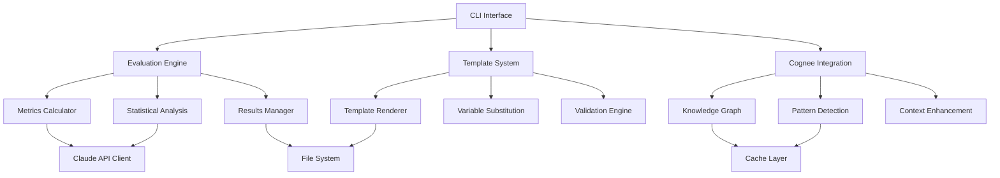

# Architecture Overview

This document provides a comprehensive overview of Voyager-4's system architecture, including core components, design patterns, and integration points.

## System Architecture

### High-Level Architecture

```
┌─────────────────────────────────────────────────────────────────┐
│                    Voyager-4 Framework                         │
├─────────────────────────────────────────────────────────────────┤
│  User Interface Layer                                          │
│  ┌─────────────┐ ┌─────────────┐ ┌─────────────┐              │
│  │ CLI Tools   │ │ Python API  │ │ Web Dashboard│              │
│  └─────────────┘ └─────────────┘ └─────────────┘              │
├─────────────────────────────────────────────────────────────────┤
│  Core Services Layer                                           │
│  ┌─────────────┐ ┌─────────────┐ ┌─────────────┐              │
│  │ Evaluation  │ │ Template    │ │ Cognee      │              │
│  │ Engine      │ │ System      │ │ Integration │              │
│  └─────────────┘ └─────────────┘ └─────────────┘              │
├─────────────────────────────────────────────────────────────────┤
│  Data Processing Layer                                         │
│  ┌─────────────┐ ┌─────────────┐ ┌─────────────┐              │
│  │ Metrics     │ │ Statistical │ │ Knowledge   │              │
│  │ Calculator  │ │ Analysis    │ │ Graph       │              │
│  └─────────────┘ └─────────────┘ └─────────────┘              │
├─────────────────────────────────────────────────────────────────┤
│  Infrastructure Layer                                          │
│  ┌─────────────┐ ┌─────────────┐ ┌─────────────┐              │
│  │ Claude API  │ │ File System │ │ Caching     │              │
│  │ Client      │ │ Manager     │ │ Layer       │              │
│  └─────────────┘ └─────────────┘ └─────────────┘              │
└─────────────────────────────────────────────────────────────────┘
```

### Component Relationships



## Core Components

### 1. Evaluation Engine

**Purpose**: Comprehensive prompt testing and measurement system.

**Key Classes**:
- `PromptEvaluator`: Single prompt evaluation
- `PromptComparator`: Multi-prompt statistical comparison
- `BatchEvaluator`: Bulk evaluation processing
- `MetricCalculator`: Individual metric computation

**Architecture**:
```python
class EvaluationEngine:
    """
    Core evaluation system architecture.
    
    Components:
    - Evaluators: Different evaluation strategies
    - Metrics: Measurement algorithms
    - Comparators: Statistical comparison tools
    - Reporters: Result formatting and export
    """
    
    def __init__(self):
        self.evaluators = self._initialize_evaluators()
        self.metrics = self._initialize_metrics()
        self.comparators = self._initialize_comparators()
        self.reporters = self._initialize_reporters()
    
    def evaluate(self, prompt, test_cases, methods):
        """Execute evaluation pipeline."""
        # 1. Validation
        self._validate_inputs(prompt, test_cases)
        
        # 2. Execution
        results = {}
        for method in methods:
            evaluator = self.evaluators[method]
            results[method] = evaluator.evaluate(prompt, test_cases)
        
        # 3. Aggregation
        aggregated = self._aggregate_results(results)
        
        # 4. Reporting
        report = self.reporters.generate(aggregated)
        
        return report
```

**Design Patterns**:
- **Strategy Pattern**: Different evaluation methods
- **Factory Pattern**: Metric creation
- **Observer Pattern**: Progress notifications
- **Command Pattern**: Evaluation pipeline steps

### 2. Template System

**Purpose**: Hierarchical prompt template management and enhancement.

**Architecture**:
```python
class TemplateSystem:
    """
    Template management architecture.
    
    Hierarchy:
    - Base: Clear instructions
    - Enhanced: + Examples
    - Advanced: + Chain of thought
    - Structured: + XML tags
    - Specialized: + System prompts
    - Cognee-powered: + AI enhancement
    """
    
    def __init__(self):
        self.hierarchy = self._build_hierarchy()
        self.renderer = TemplateRenderer()
        self.validator = TemplateValidator()
        self.enhancer = CogneeEnhancer()
    
    def render(self, template_path, variables):
        """Render template with variable substitution."""
        # 1. Load template
        template = self._load_template(template_path)
        
        # 2. Validate structure
        self.validator.validate(template)
        
        # 3. Substitute variables
        rendered = self.renderer.render(template, variables)
        
        # 4. Apply enhancements (if enabled)
        if self._cognee_enabled():
            enhanced = self.enhancer.enhance(rendered)
            return enhanced
        
        return rendered
```

**Template Hierarchy**:
```
templates/
├── base/               # Level 1: Direct instructions
│   ├── template.md
│   ├── metadata.yaml
│   └── examples/
├── enhanced/           # Level 2: + Examples
│   ├── template.md
│   ├── examples.md
│   └── guidelines.md
├── advanced/           # Level 3: + Reasoning
│   ├── template.md
│   ├── reasoning.md
│   └── verification.md
├── structured/         # Level 4: + XML tags
│   ├── template.md
│   ├── schema.xml
│   └── parser.py
├── specialized/        # Level 5: + System prompts
│   ├── template.md
│   ├── system_prompt.md
│   └── domain_config.yaml
└── cognee-powered/     # Level 6: + AI enhancement
    ├── engine.py
    ├── enhancer.py
    └── generated/
```

### 3. Cognee Integration

**Purpose**: AI-powered codebase analysis and template enhancement.

**Architecture**:
```python
class CogneeIntegration:
    """
    AI enhancement system using Cognee knowledge graphs.
    
    Components:
    - Analyzer: Codebase analysis
    - Graph Builder: Knowledge graph construction
    - Pattern Detector: Architectural pattern recognition
    - Context Generator: Contextual prompt enhancement
    """
    
    def __init__(self, config):
        self.analyzer = CodebaseAnalyzer(config)
        self.graph_builder = KnowledgeGraphBuilder(config)
        self.pattern_detector = PatternDetector(config)
        self.context_generator = ContextGenerator(config)
    
    def analyze_codebase(self, repo_path):
        """Comprehensive codebase analysis."""
        # 1. Code analysis
        code_structure = self.analyzer.analyze(repo_path)
        
        # 2. Knowledge graph construction
        knowledge_graph = self.graph_builder.build(code_structure)
        
        # 3. Pattern detection
        patterns = self.pattern_detector.detect(knowledge_graph)
        
        # 4. Context generation
        context = self.context_generator.generate(
            knowledge_graph, patterns
        )
        
        return AnalysisResult(
            structure=code_structure,
            graph=knowledge_graph,
            patterns=patterns,
            context=context
        )
```

**Knowledge Graph Structure**:
```python
class KnowledgeGraph:
    """
    Structured representation of codebase knowledge.
    
    Nodes:
    - Components: Classes, functions, modules
    - Dependencies: Imports, calls, relationships
    - Patterns: Architectural and design patterns
    - Documentation: Comments, docs, README
    
    Edges:
    - Imports: Module dependencies
    - Calls: Function/method invocations
    - Inherits: Class inheritance
    - Implements: Interface implementation
    """
    
    def __init__(self):
        self.nodes = {}
        self.edges = {}
        self.patterns = {}
        self.metadata = {}
```

### 4. Metrics and Statistical Analysis

**Purpose**: Comprehensive measurement and statistical validation.

**Metric Types**:
```python
class MetricCalculator:
    """
    Multi-method evaluation metrics.
    
    Methods:
    - ExactMatch: Binary accuracy for categorical outputs
    - CosineSimilarity: Semantic consistency measurement
    - LLMGrade: Quality assessment using Claude
    - ROUGEScore: Text overlap analysis
    """
    
    def __init__(self):
        self.metrics = {
            'exact_match': ExactMatchMetric(),
            'cosine_similarity': CosineSimilarityMetric(),
            'llm_grade': LLMGradeMetric(),
            'rouge_score': ROUGEScoreMetric()
        }
    
    def calculate(self, method, predictions, actuals, context=None):
        """Calculate metric using specified method."""
        metric = self.metrics[method]
        return metric.calculate(predictions, actuals, context)
```

**Statistical Analysis**:
```python
class StatisticalAnalysis:
    """
    Statistical validation and significance testing.
    
    Tests:
    - Chi-square: Categorical data differences
    - T-test: Continuous metric comparisons
    - Mann-Whitney U: Non-parametric comparisons
    - Bonferroni: Multiple comparison correction
    """
    
    def compare_groups(self, group_a, group_b, test_type='auto'):
        """Statistical comparison between two groups."""
        # 1. Determine appropriate test
        if test_type == 'auto':
            test_type = self._select_test(group_a, group_b)
        
        # 2. Execute statistical test
        statistic, p_value = self._execute_test(
            test_type, group_a, group_b
        )
        
        # 3. Interpret results
        significance = p_value < self.alpha
        effect_size = self._calculate_effect_size(group_a, group_b)
        
        return StatisticalResult(
            test_type=test_type,
            statistic=statistic,
            p_value=p_value,
            significant=significance,
            effect_size=effect_size
        )
```

## Design Patterns

### 1. Strategy Pattern

Used for evaluation methods and template enhancement strategies:

```python
class EvaluationStrategy(ABC):
    """Abstract evaluation strategy."""
    
    @abstractmethod
    def evaluate(self, prompt, test_cases):
        pass

class ExactMatchStrategy(EvaluationStrategy):
    """Exact match evaluation strategy."""
    
    def evaluate(self, prompt, test_cases):
        # Implementation for exact match evaluation
        pass

class CosineSimilarityStrategy(EvaluationStrategy):
    """Cosine similarity evaluation strategy."""
    
    def evaluate(self, prompt, test_cases):
        # Implementation for cosine similarity evaluation
        pass
```

### 2. Factory Pattern

Used for creating metrics, evaluators, and templates:

```python
class MetricFactory:
    """Factory for creating evaluation metrics."""
    
    _metrics = {
        'exact_match': ExactMatchMetric,
        'cosine_similarity': CosineSimilarityMetric,
        'llm_grade': LLMGradeMetric,
        'rouge_score': ROUGEScoreMetric
    }
    
    @classmethod
    def create_metric(cls, metric_type, config=None):
        """Create metric instance by type."""
        if metric_type not in cls._metrics:
            raise ValueError(f"Unknown metric type: {metric_type}")
        
        metric_class = cls._metrics[metric_type]
        return metric_class(config)
```

### 3. Observer Pattern

Used for progress tracking and event notifications:

```python
class EvaluationObserver(ABC):
    """Observer for evaluation events."""
    
    @abstractmethod
    def on_evaluation_start(self, event):
        pass
    
    @abstractmethod
    def on_evaluation_progress(self, event):
        pass
    
    @abstractmethod
    def on_evaluation_complete(self, event):
        pass

class ProgressTracker(EvaluationObserver):
    """Track evaluation progress."""
    
    def on_evaluation_progress(self, event):
        progress = event.completed / event.total
        print(f"Progress: {progress:.1%}")
```

### 4. Command Pattern

Used for evaluation pipeline and batch operations:

```python
class EvaluationCommand(ABC):
    """Abstract evaluation command."""
    
    @abstractmethod
    def execute(self):
        pass
    
    @abstractmethod
    def undo(self):
        pass

class SingleEvaluationCommand(EvaluationCommand):
    """Command for single prompt evaluation."""
    
    def __init__(self, evaluator, prompt, test_cases):
        self.evaluator = evaluator
        self.prompt = prompt
        self.test_cases = test_cases
        self.result = None
    
    def execute(self):
        self.result = self.evaluator.evaluate(
            self.prompt, self.test_cases
        )
        return self.result
```

## Data Flow

### Evaluation Pipeline

```
┌─────────────┐    ┌─────────────┐    ┌─────────────┐    ┌─────────────┐
│   Input     │ -> │ Validation  │ -> │ Processing  │ -> │   Output    │
│ Validation  │    │ & Parsing   │    │ & Analysis  │    │ Generation  │
└─────────────┘    └─────────────┘    └─────────────┘    └─────────────┘
       |                   |                   |                   |
   ┌────────┐         ┌────────┐         ┌────────┐         ┌────────┐
   │Prompts │         │Template│         │Metrics │         │Reports │
   │Tests   │         │Render  │         │Stats   │         │Exports │
   │Config  │         │Enhance │         │Compare │         │Archive │
   └────────┘         └────────┘         └────────┘         └────────┘
```

### Template Enhancement Flow

```
┌─────────────┐    ┌─────────────┐    ┌─────────────┐    ┌─────────────┐
│  Codebase   │ -> │   Cognee    │ -> │  Template   │ -> │  Enhanced   │
│  Analysis   │    │  Analysis   │    │ Enhancement │    │  Template   │
└─────────────┘    └─────────────┘    └─────────────┘    └─────────────┘
       |                   |                   |                   |
   ┌────────┐         ┌────────┐         ┌────────┐         ┌────────┐
   │Code    │         │Patterns│         │Context │         │AI      │
   │Files   │         │Graph   │         │Inject  │         │Enhanced│
   │Docs    │         │Insight │         │Adapt   │         │Output  │
   └────────┘         └────────┘         └────────┘         └────────┘
```

## Integration Points

### External APIs

**Claude API Integration**:
```python
class ClaudeAPIClient:
    """Centralized Claude API client."""
    
    def __init__(self, config):
        self.client = Anthropic(api_key=config.api_key)
        self.config = config
        self.rate_limiter = RateLimiter(config.rate_limit)
        self.retry_handler = RetryHandler(config.retry_config)
    
    async def generate_response(self, prompt, **kwargs):
        """Generate response with rate limiting and retry."""
        await self.rate_limiter.acquire()
        
        try:
            response = await self.retry_handler.execute(
                lambda: self.client.messages.create(
                    model=kwargs.get('model', self.config.default_model),
                    messages=[{'role': 'user', 'content': prompt}],
                    **kwargs
                )
            )
            return response.content[0].text
        except Exception as e:
            self.logger.error(f"API call failed: {e}")
            raise
```

**Cognee MCP Integration**:
```python
class CogneeMCPClient:
    """Cognee Model Context Protocol client."""
    
    def __init__(self, config):
        self.config = config
        self.session = self._initialize_session()
    
    async def analyze_codebase(self, repo_path):
        """Analyze codebase using Cognee MCP."""
        # Use MCP tools for codebase analysis
        result = await self.session.call_tool(
            'mcp__cognee__codify',
            {'repo_path': repo_path}
        )
        return result
    
    async def search_knowledge_graph(self, query, search_type):
        """Search Cognee knowledge graph."""
        result = await self.session.call_tool(
            'mcp__cognee__search',
            {'search_query': query, 'search_type': search_type}
        )
        return result
```

### File System Architecture

```
data/
├── cache/              # Cached results and computations
│   ├── evaluations/    # Cached evaluation results
│   ├── templates/      # Rendered template cache
│   └── cognee/         # Cognee analysis cache
├── results/            # Evaluation results
│   ├── reports/        # Generated reports
│   ├── exports/        # Data exports
│   └── archive/        # Archived results
├── graphs/             # Knowledge graphs
│   ├── nodes/          # Graph nodes
│   ├── edges/          # Graph edges
│   └── metadata/       # Graph metadata
└── temp/               # Temporary files
    ├── processing/     # Processing artifacts
    └── uploads/        # Uploaded files
```

## Performance Considerations

### Caching Strategy

```python
class CacheManager:
    """Multi-level caching system."""
    
    def __init__(self, config):
        self.memory_cache = LRUCache(config.memory_cache_size)
        self.disk_cache = DiskCache(config.disk_cache_path)
        self.redis_cache = RedisCache(config.redis_config)
    
    def get(self, key):
        """Retrieve from cache with fallback hierarchy."""
        # Level 1: Memory cache
        value = self.memory_cache.get(key)
        if value is not None:
            return value
        
        # Level 2: Disk cache
        value = self.disk_cache.get(key)
        if value is not None:
            self.memory_cache.set(key, value)
            return value
        
        # Level 3: Redis cache
        value = self.redis_cache.get(key)
        if value is not None:
            self.memory_cache.set(key, value)
            self.disk_cache.set(key, value)
            return value
        
        return None
```

### Concurrency and Parallelism

```python
class ConcurrentEvaluator:
    """Concurrent evaluation processing."""
    
    def __init__(self, max_workers=5):
        self.max_workers = max_workers
        self.executor = ThreadPoolExecutor(max_workers=max_workers)
        self.semaphore = asyncio.Semaphore(max_workers)
    
    async def evaluate_batch(self, evaluations):
        """Evaluate multiple prompts concurrently."""
        tasks = []
        for evaluation in evaluations:
            task = self._evaluate_with_semaphore(evaluation)
            tasks.append(task)
        
        results = await asyncio.gather(*tasks, return_exceptions=True)
        return self._process_results(results)
    
    async def _evaluate_with_semaphore(self, evaluation):
        """Evaluate with concurrency control."""
        async with self.semaphore:
            return await self._evaluate_single(evaluation)
```

## Security Architecture

### API Security

```python
class SecureAPIClient:
    """Secure API client with authentication and validation."""
    
    def __init__(self, config):
        self.config = config
        self.auth_manager = AuthenticationManager(config)
        self.validator = RequestValidator()
        self.encryptor = DataEncryptor(config.encryption_key)
    
    async def make_request(self, endpoint, data):
        """Make secure API request."""
        # 1. Authenticate
        auth_token = await self.auth_manager.get_token()
        
        # 2. Validate request
        self.validator.validate_request(data)
        
        # 3. Encrypt sensitive data
        encrypted_data = self.encryptor.encrypt_sensitive_fields(data)
        
        # 4. Make request with security headers
        headers = {
            'Authorization': f'Bearer {auth_token}',
            'Content-Type': 'application/json',
            'X-Request-ID': str(uuid.uuid4())
        }
        
        response = await self._execute_request(
            endpoint, encrypted_data, headers
        )
        
        # 5. Decrypt response if needed
        if response.encrypted:
            response.data = self.encryptor.decrypt(response.data)
        
        return response
```

### Data Protection

```python
class DataProtectionManager:
    """Manage sensitive data protection."""
    
    def __init__(self, config):
        self.encryption_key = config.encryption_key
        self.sanitizer = DataSanitizer()
        self.access_control = AccessController(config)
    
    def protect_evaluation_data(self, evaluation_data):
        """Protect sensitive evaluation data."""
        # 1. Sanitize inputs
        sanitized = self.sanitizer.sanitize(evaluation_data)
        
        # 2. Encrypt sensitive fields
        encrypted = self._encrypt_sensitive_fields(sanitized)
        
        # 3. Apply access controls
        protected = self.access_control.apply_controls(encrypted)
        
        return protected
```

## Monitoring and Observability

### Performance Monitoring

```python
class PerformanceMonitor:
    """Monitor system performance and health."""
    
    def __init__(self):
        self.metrics_collector = MetricsCollector()
        self.alert_manager = AlertManager()
        self.dashboard = PerformanceDashboard()
    
    def track_evaluation(self, evaluation_func):
        """Decorator to track evaluation performance."""
        def wrapper(*args, **kwargs):
            start_time = time.time()
            
            try:
                result = evaluation_func(*args, **kwargs)
                
                # Record success metrics
                duration = time.time() - start_time
                self.metrics_collector.record_success(
                    function_name=evaluation_func.__name__,
                    duration=duration,
                    result_size=len(str(result))
                )
                
                return result
                
            except Exception as e:
                # Record error metrics
                self.metrics_collector.record_error(
                    function_name=evaluation_func.__name__,
                    error_type=type(e).__name__,
                    error_message=str(e)
                )
                
                # Trigger alerts if needed
                self.alert_manager.check_error_threshold()
                
                raise
        
        return wrapper
```

## Extensibility

### Plugin Architecture

```python
class PluginManager:
    """Manage framework plugins and extensions."""
    
    def __init__(self):
        self.plugins = {}
        self.hooks = defaultdict(list)
    
    def register_plugin(self, plugin_class):
        """Register a new plugin."""
        plugin = plugin_class()
        self.plugins[plugin.name] = plugin
        
        # Register plugin hooks
        for hook_name in plugin.hooks:
            self.hooks[hook_name].append(plugin)
    
    def execute_hook(self, hook_name, *args, **kwargs):
        """Execute all plugins for a specific hook."""
        results = []
        for plugin in self.hooks[hook_name]:
            try:
                result = plugin.execute_hook(hook_name, *args, **kwargs)
                results.append(result)
            except Exception as e:
                self.logger.error(f"Plugin {plugin.name} failed: {e}")
        
        return results

class BasePlugin(ABC):
    """Base class for framework plugins."""
    
    @property
    @abstractmethod
    def name(self):
        pass
    
    @property
    @abstractmethod
    def hooks(self):
        pass
    
    @abstractmethod
    def execute_hook(self, hook_name, *args, **kwargs):
        pass
```

---

**This architecture overview provides the foundation for understanding Voyager-4's design and implementation.** For specific implementation details, see the [API Reference](../api_reference/) or [Development Setup Guide](development_setup.md).

*Questions about the architecture? Check our [Developer FAQ](../faq.md) or join our community discussions.*